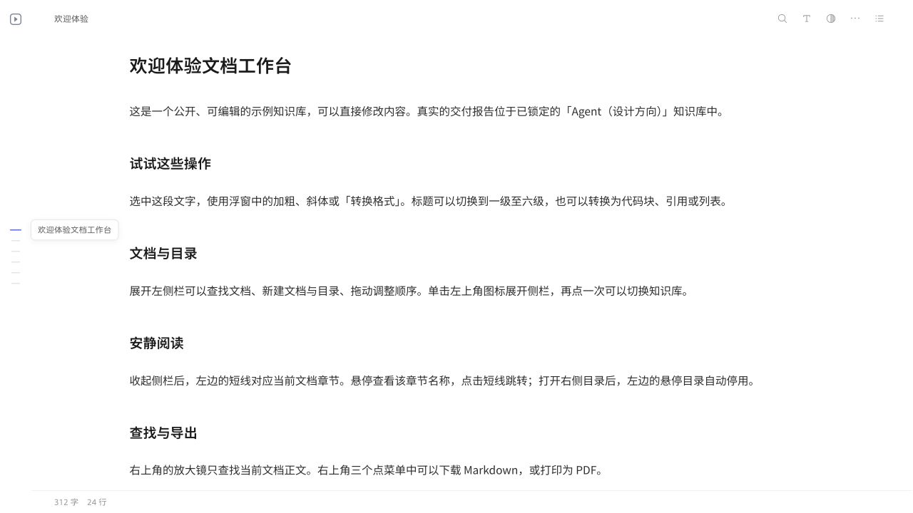

# Reader

**为人与 Agent 一起阅读、撰写和整理资料准备的本地文档工作台。**

Agent 可以在工作区生成文档、收集网页和处理资料，但产出的文件常常散落在不同目录里。Reader 把阅读、修改和归档接起来：在 DSH 中查看成果，把需要长期保留的内容收录进知识库，下次继续找回、引用和修改。

正文保留为普通文件，数据留在本机。Markdown 是主要写作格式，同时支持 PDF 和 H5 预览。它适合个人调研、学习、项目记录和交付整理；目前不提供多人实时协作。



## 从一次工作到长期积累

1. **在工作区查看**：从 DSH 打开 Agent 生成的 Markdown，阅读正文与相对图片，原文件仍在项目目录。
2. **保留有用的内容**：收录到知识库时创建独立副本，之后可整理文件夹、修改正文和设置页面外观。
3. **继续工作**：同时打开多篇文档，搜索已有资料；可单独授权 Agent 访问指定知识库。
4. **需要时给别人看**：临时分享生成只读快照，主动更新后访客才看到新内容。

阅读体验包括长文目录、正文宽度、字体、行距、主题、代码高亮和公式。Markdown 支持富文本编辑；遇到编辑器不能完整还原的结构时保留源码编辑保护，不静默改写原文。

## 安装与版本

当前公开安装包：[v0.1.0-preview.2](https://github.com/bigricedumpling/deepseek-reader/releases/tag/v0.1.0-preview.2)。在 DSH NEXT 的「插件 → 添加插件」选择发布页的 `.tgz`，再从右侧栏「开始 → 阅读器」进入。**安装包自带 Reader 页面和本机服务，不需要用户另装 Reader 或 Node.js。**

本分支正在开发 `0.2.0-preview.1`，尚未发布，不能把这里的新能力视为已安装版本的能力。市场审核与安装包发布是两个独立步骤；市场是否可搜索以实际收录为准。

公开 Preview 已验证 macOS DSH NEXT。新分支已补 Windows/Linux 的数据路径与安装声明，但仍需真实宿主安装验收。Web 技术栈不意味着宿主、进程和文件管理器行为自动跨平台一致。见 [平台与发布验收](docs/RELEASE-READINESS.md)。

## 内容存在哪里

| 内容 | 所在位置与关系 |
| --- | --- |
| 工作区原文件 | 原项目目录；预览不会移动它 |
| 工作区浏览记录 | 本机保存的预览记录；不是知识库阅读历史 |
| 收录的文档 | 知识库中的独立副本，默认私有；与原文件不双向同步 |
| 页面设置、稳定标识、版本索引 | 知识库的 `.reader/state.sqlite` |
| 分享快照 | 主动生成的公开副本；原文后续修改不会自动发布 |

默认插件数据目录：macOS 为 `~/Library/Application Support/Reader/知识库`；新分支 Windows 为 `%APPDATA%\Reader\知识库`，Linux 为 `$XDG_DATA_HOME/Reader/知识库`（未设置时使用 `~/.local/share`）。更新或移除插件不会主动删除该目录。正文和元数据需要一起备份，详见 [数据与恢复](docs/DATA-AND-RECOVERY.md)。

## 权限与分享

本机管理无需账号。Agent 访问是可选功能，需要明确授权范围；安装阅读器不等于授权 Agent 读取所有资料。

临时分享是只读快照。服务器上的公开示例库则可被部署者设为可编辑，两者不是相同的分享机制。Reader 不承诺本机地址可以直接让其他人访问；临时外网分享还依赖隧道服务和网络。

服务器部署、认证和历史交付链接见 [部署与兼容约束](docs/DEPLOYMENT.md)。个人交付资料不属于插件安装包。

## 开发

需要 Node.js 24 或更新版本。源码开发者自行安装 Node.js；插件用户无需安装。

```bash
npm ci
npm run dev
```

开发服务默认使用仓库旁的 `知识库`。建议设置 `DOCS_ROOT` 指向专用开发目录，避免拿日常资料做实验。生产构建 `npm run build` 不再初始化知识库。

```bash
npm run check
npm run typecheck
npm run test:access
npm run test:routes
npm run test:plugin
npm run test:lifecycle
npm run test:transfer
npm run build
```

主要技术：Vue 3、Pinia、Vite、Milkdown、Markdown-it、Shiki、Mermaid、PDF.js；Node.js 文件服务与 SQLite 元数据。TypeScript 从接口契约渐进引入，现有代码并未完成全面迁移。见 [工程原则](docs/ENGINEERING.md)。

## 项目资料

- [产品定位与边界](docs/PRODUCT.md)
- [插件安装和连接](plugins/reader-workspace/README.md)
- [数据、备份与恢复](docs/DATA-AND-RECOVERY.md)
- [版本变化](CHANGELOG.md)
- [已知问题与正式版门槛](docs/RELEASE-READINESS.md)
- [既有存储架构](docs/数据与扩展架构.md)

MIT License。字体等第三方资产保留各自许可；HarmonyOS Sans 授权见 [字体许可](public/fonts/HarmonyOS-Sans-LICENSE.txt)。
