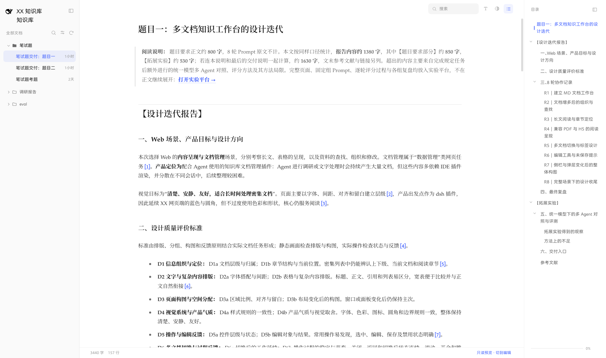
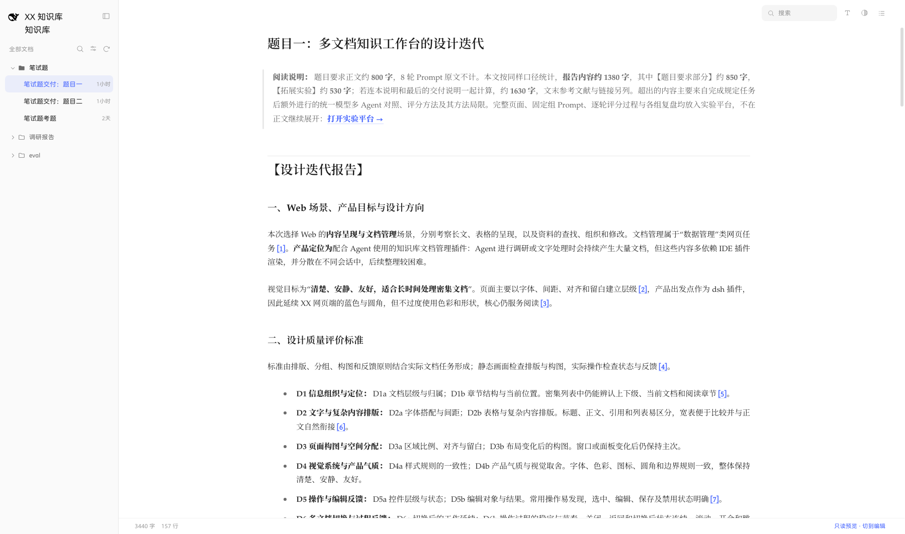

# 文档工作台

一个用于集中阅读、整理和编辑 Agent 产出文档的本地 Web 工具。



它主要解决的是一个比较具体的问题：使用 Agent 做调研、写作或资料整理时，文档会不断产生，而且通常分散在不同会话、项目目录或 IDE 插件里。临时预览很方便，但随着文档数量增加，后续会逐渐遇到几个问题：

- 同一主题下文档太多，不容易判断层级和归属
- 同一份内容可能有多个版本，不容易继续阅读和整理
- Markdown、PDF、H5 等格式分散在不同工具里
- 阅读过程中发现问题后，需要重新回到源码或其他编辑器修改
- Agent 生成的内容很多，但缺少一个适合长期阅读和整理的统一入口

因此，这个工具定位为一个**配合 Agent 使用的文档工作台**。

它不负责生成文档，也不是完整的笔记软件。主要功能集中在三件事上：

1. 把不同来源的文档集中起来管理
2. 提供适合长时间阅读的统一界面
3. 在阅读过程中直接完成必要的修改和整理

---

## 产品结构

整体采用三栏布局：

- **左侧：文档管理**
- **中间：正文阅读与编辑**
- **右侧：当前文档目录**

左侧负责"找到哪篇文档"，右侧负责"找到当前文档里的位置"，中间尽量只保留正文内容。

这样做是为了把**文档导航**和**章节导航**分开，避免在一个侧栏里同时处理两个层级。

### 左侧文档区

支持：

- 多层分组
- 文档搜索
- 展开和收起
- 当前文档状态
- 文档和分组拖拽排序
- 新建和删除文档

拖拽后的顺序会保存到：

```text
.顺序.json
```



### 中间正文区

目前支持：

- Markdown
- PDF
- H5 页面
- 表格
- 代码块
- Mermaid
- LaTeX
- 引用
- 列表
- 脚注

Markdown 文档可以直接在正文中编辑，不需要切换到源码输入框。

### 右侧目录

根据当前 Markdown 文档生成章节目录。

支持：

- 多级标题
- 当前章节高亮
- 点击跳转
- 跟随正文滚动
- 整体收起

### 搜索

左栏顶部可以按名称筛选文档，匹配范围包括文档名、分组名和路径。


---

## 设计方向

这个工具首先面向长时间阅读和密集文档处理，因此整体设计目标是：

**清楚、安静、友好。**

重点不是增加更多视觉效果，而是尽量减少阅读之外的信息干扰。

### 正文优先

正文是页面的主要区域。

标题、作者、时间、标签等附属信息只保留必要部分，避免在正文顶部堆叠过多卡片或状态。

侧栏和工具也尽量保持较低的视觉权重。

### 一个主要彩色

界面主要使用一种蓝色：

```css
#4d6bfe
```

主要用于：

- 当前选中项
- 可操作状态
- 必要的交互反馈

其他信息主要使用灰阶，而不是继续增加颜色。

```css
--c-ink    #1a1a1a
--c-text   #2f2f2f
--c-sub    #6b6b6b
--c-faint  #9a9a9a
```

标题、正文、说明和弱信息主要通过字重和灰阶建立层级。

### 层级主要依靠排版

文档树和章节目录不会大量使用不同颜色区分层级。

主要依靠：

- 缩进
- 字号
- 字重
- 间距

来表达上下级关系。

这样在文档或目录比较长时，信息密度可以保持在比较稳定的状态。

### 操作按需要出现

一些低频操作默认不长期占据界面。

例如：

- 文档行的操作按钮
- 目录中的辅助操作
- 编辑工具栏

通常在悬停、选中或编辑时出现。

默认状态下尽量只显示阅读真正需要的信息。

### 多种格式共用一个阅读框架

Markdown、PDF 和 H5 的内容结构不同，因此不会强行让它们使用完全相同的工具。

例如：

- Markdown 显示章节目录和编辑能力
- PDF 使用适合 PDF 的阅读方式
- H5 保留页面本身的内容结构

但它们共用同一套文档导航、标签、颜色、间距和基本控件规则。

目标是保持工作台整体一致，而不是把不同格式强行做成一样。

---

## Markdown 编辑

正文采用所见即所得编辑方式。

点击段落、标题等内容后，可以直接进行修改。

目前支持：

- 标题
- 普通段落
- 列表项
- 引用
- 表格单元格

编辑完成后，内容会重新写回原始 Markdown 文件，而不是保存成 HTML 或专有格式。

行内的加粗、链接等 Markdown 信息会尽量保留。

这里的目标不是实现完整的富文本编辑器，而是让阅读过程中发现的小问题可以直接修改，不需要频繁在阅读页面和源码之间切换。

---

## Markdown 的两套处理路径

项目中阅读和编辑使用两套不同的 Markdown 处理方式。

### 阅读

阅读时使用 `markdown-it`：

```text
Markdown
→ markdown-it
→ HTML
```

这样可以比较直接地控制：

- 表格
- 脚注
- 上下标
- LaTeX
- 代码高亮
- 其他 Markdown 扩展

### 编辑

编辑时使用 Milkdown Crepe：

```text
Markdown
→ ProseMirror
→ 编辑
→ Markdown
```

问题是，编辑器重新序列化 Markdown 时可能产生一些与内容无关的修改，例如：

```text
---       → ***
表格      → 自动补齐空格
裸链接    → <https://example.com>
```

虽然内容没有变化，但原始 Markdown 会发生大量格式变化。

因此保存之前会经过：

```text
src/utils/markdown-normalize.js
```

用于尽量还原编辑器产生的纯格式变化。

表格会进一步按单元格与原文比较。内容没有修改的部分尽量继续沿用原始 Markdown，避免 `<br>` 等内容在往返编辑中被破坏。

如果检测到无法安全还原的变化，不会直接覆盖源文件。

界面会提示差异，用户可以选择是否按编辑器规范重新整理这篇文档。

---

## 分享模式

除了编辑模式，还提供 `/onlyread` 只读入口。

分享范围通过文档根目录下的 `.分享.json` 控制：

```json
{
  "shared": {
    "面试": false,
    "笔试题/笔试题思路.md": false,
    "调研报告": true
  }
}
```

默认不分享。

只有显式开启的文件或目录才会出现在只读模式中。

目前分享粒度支持：

- 整个目录
- 单个文件

暂时不支持：

- 只分享某篇文档中的部分章节
- 针对不同访问者设置不同权限

---

## 快速开始

```bash
npm install
npm run dev
```

开发环境默认地址：

```text
http://127.0.0.1:8090/edit
```

首次进入编辑模式需要密码。

默认密码：

```text
zongzi
```

配置位置：

```text
server/share.js
```

也可以使用环境变量：

```bash
READER_PASSWORD=your-password npm run dev
```

---

## 页面入口

| 地址 | 用途 |
| --- | --- |
| `/edit` | 编辑模式 |
| `/edit/<文档路径>` | 直接打开指定文档 |
| `/onlyread` | 只读分享模式 |

---

## 技术栈

| 技术 | 用途 |
| --- | --- |
| Vue 3 | 页面框架 |
| Vite 6 | 构建 |
| Pinia | 状态管理 |
| Milkdown Crepe | Markdown 编辑 |
| markdown-it | Markdown 阅读态渲染 |
| Shiki | 代码高亮 |
| Mermaid | 图表 |
| pdfjs-dist | PDF 阅读 |
| Phosphor Icons | 图标 |

---

## 代码结构

| 文件 | 用途 |
| --- | --- |
| `src/main.js` | 应用入口 |
| `src/App.vue` | 主界面 |
| `src/stores/docs.js` | 文档树、当前文档和读写接口 |
| `src/stores/reader.js` | 阅读设置 |
| `src/views/DocView.vue` | 正文区域和编辑逻辑 |
| `src/components/Sidebar.vue` | 左侧文档栏 |
| `src/components/TocPanel.vue` | 右侧目录 |
| `src/components/MarkdownEditor.vue` | Markdown 编辑器封装 |
| `src/components/DocPicker.vue` | 插入文档的选择器 |
| `src/utils/markdown.js` | Markdown 渲染 |
| `src/utils/markdown-normalize.js` | Markdown 回写处理 |
| `src/utils/toc-fold.js` | 目录折叠 |
| `src/styles/tokens.css` | 样式变量 |
| `server/content-api.js` | 文档读写接口 |
| `server/share.js` | 编辑权限和分享范围 |

---

## 本地检查

```bash
npm run check
```

检查模块导入和依赖导出。

```bash
npm run regression
```

使用临时沙箱测试 Markdown 编辑和保存流程，不修改真实文档。

```bash
npm run e2e
```

目前主要覆盖：

- Markdown 往返
- 控件状态
- 表格列宽
- 侧栏

---

## 部署

```bash
npm run build
node server/serve.js
```

默认端口：

```text
8091
```

如果部署到子路径：

```bash
VITE_BASE=/deepseek/reader/ npm run build
```

服务端只使用 Node 内置模块，运行时不需要 `node_modules`。

---

## 当前限制

### 表格编辑

阅读态已经支持表格显示和横向滚动。

编辑态目前主要支持修改单元格内容，还不能完整处理增删行列。列宽调整和编辑器之间也还没有完全打通。

### 移动端

当前主要按照桌面工作台设计。

窗口变窄时会逐步收起侧栏，但没有针对手机重新设计完整布局。

### PDF

PDF 可以正常打开和翻页。

目录提取和翻译功能目前只有基本链路，扫描件等情况仍可能失败。

### 搜索

目前搜索范围包括：

- 文档名称
- 分组名称
- 文件路径

暂时不支持正文全文搜索。

### 版本历史

目前只保留当前文件状态，没有完整的历史版本、差异比较和恢复功能。

### 分享

目前权限只控制到文件和目录级别。

### 前端体积

Milkdown Crepe、Mermaid、Shiki 等依赖较重。

目前主要用于本地环境，如果继续用于公网部署，还需要进一步做拆包和加载优化。
