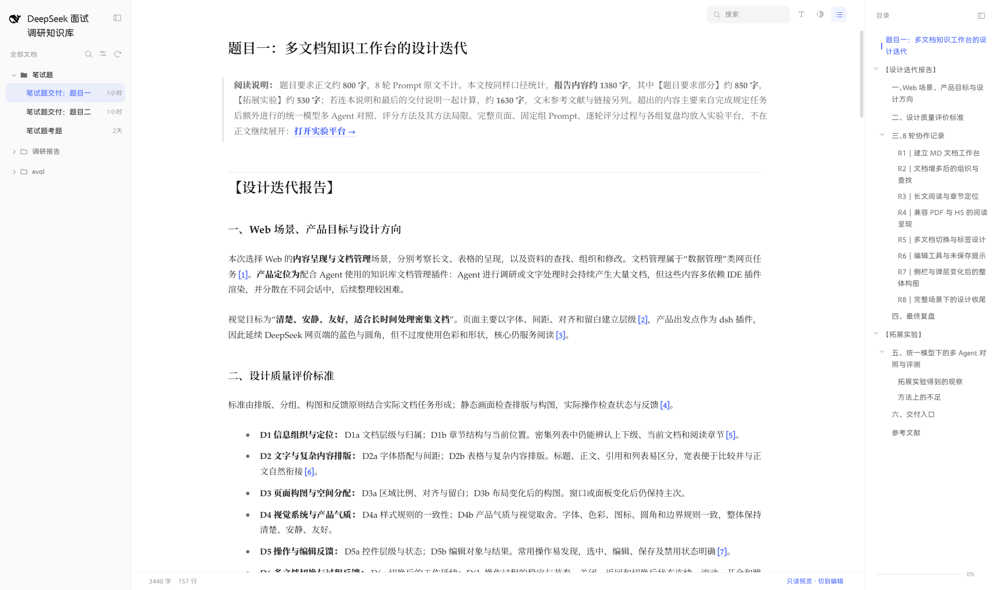

# 文档工作台 · Docs Workbench

一个给自己用的文档阅读与整理工具。左边是分组和文档，中间读，右边是目录。正文可以直接改，改完立刻是最终效果。

它不是 Markdown 编辑器，也不是笔记软件。它只处理一件事：**Agent 持续产出的文档太多、太散，需要一个地方安静地读完并且整理。**



---

## 为什么做这个

我在用 Agent 做调研和写作的时候，文档是源源不断出来的。它们散在不同的会话里，多数靠 IDE 插件临时渲染，关掉就找不着了。

真正的问题不是「文档不够多」，是**没有人把它们读完**。同一份文档改了三版，我不知道哪版是新的；十几篇文档挂在同一个主题下，我记不住谁是谁。

所以这个工具的目标很具体：

- **一次收敛**：所有产出汇总到一个地方，按时间排
- **可信来源**：每篇都标出是哪个 Agent 产出的、什么时候更新的
- **专注阅读**：正文之外的东西全部退到边上，需要时再出来

它不负责生产文档，只负责把文档读清楚。

---

## 怎么用

```bash
npm install
npm run dev          # → http://127.0.0.1:8090/edit
```

打开之后是编辑模式，首次需要密码（默认 `zongzi`，写在 `server/share.js` 的 `EDIT_PASSWORD`，可以用环境变量 `READER_PASSWORD` 覆盖）。

**三个入口：**

| 地址 | 用途 |
|---|---|
| `/edit` | 编辑模式，可以改正文、新建、删除、调整顺序 |
| `/edit/<文档路径>` | 直接打开某一篇 |
| `/onlyread` | 只读模式，分享给别人看的那个 |

主界面分三栏：

**左栏**是文档树，按分组排。顶部有搜索、展开收起、排序。分组和文档都能拖拽调整位置，顺序写回 `.顺序.json`。

**中间**是正文。标题、正文、引用、列表、宽表、代码块都在这里。滚动时右栏目录跟着高亮。

**右栏**是本文的章节目录，点一下跳过去，可以收起。

### 编辑

正文是所见即所得的。点任意一个段落或标题，它变成可编辑状态，工具栏浮在旁边。改完点「完成」，原文的 Markdown 同步更新——**存的是 Markdown，不是 HTML**，所以离开这个工具之后内容还是能用的。

标题、列表项、引用、表格单元格都能单独编辑，行内的加粗和链接不会被破坏。

### 分享

`/onlyread` 是给外人看的入口。谁能看到什么写在文档根目录的 `.分享.json` 里：

```json
{
  "shared": {
    "面试": false,
    "笔试题/笔试题思路.md": false,
    "调研报告": true
  }
}
```

**默认不分享**——没有显式打开过的节点，外人一律看不到。上面这份配置的结果是：调研报告全部可见，面试目录和笔试题思路隐藏。

---

## 设计上做了什么取舍

### 一个彩色，四级灰阶

整站只有一种彩色（DeepSeek 蓝 `#4d6bfe`），其余全是灰。正文层级不靠颜色区分，靠四级灰阶：

```
--c-ink    #1a1a1a   标题
--c-text   #2f2f2f   正文
--c-sub    #6b6b6b   注释
--c-faint  #9a9a9a   极弱
```

蓝色只出现在两个地方：**当前项**和**能点的地方**。别处不用。

### 操作藏起来，需要时才出现

文档行的「…」按钮、目录行的操作、编辑时的工具栏，都是悬停才浮出来的，位置固定在行尾。默认状态下的界面只有内容，没有按钮。

### 中文的斜体换成楷体

中文字体没有真正的斜体，浏览器会合成一个歪的出来。所以 `*强调*` 在中文里不倾斜，换楷体——这是中文排版的老做法。

### 目录层级靠缩进，不靠颜色

目录每一级缩进 11px，字号和字重跟着降。层级关系用位置表达，不用颜色，扫读的时候不会被打断。

---

## 技术

```
Vue 3 + Vite 6            界面与构建
Pinia                     状态
Milkdown Crepe            所见即所得编辑器
markdown-it               渲染管线
Shiki                     代码高亮
Mermaid                   图表
pdfjs-dist                PDF 阅读
Phosphor Icons            图标
```

### 两套渲染路径

这是整个项目里最关键的一个设计。

**读的时候**用 `markdown-it` 直接把 Markdown 渲染成 HTML——快，而且可控。表格、脚注、上下标、LaTeX 公式挂了一串插件。

**改的时候**用 Milkdown Crepe，它把 Markdown 解析成 ProseMirror 文档，改完再序列化回 Markdown。

问题在于 **Crepe 的序列化是有损的**：`---` 会变成 `***`，表格会被补上对齐空格，裸链接会被包进尖括号。内容不丢，但源码会变样。

所以存盘之前要过一道 `markdown-normalize.js`：把编辑器的纯外观改动还原成原文，表格单元格逐个跟原文比对——内容没变的整格沿用原文，把 `<br>` 之类的东西保住。

**有损时不自动保存。** 编辑器写完的文本跟原文对不上，界面会亮一条黄条，停下写入，把差异行列出来。用户可以选择「按编辑器规范重排这篇」，让它一次性对齐，之后这篇就能正常富文本编辑。

### 代码结构

| 文件 | 干什么 |
|---|---|
| `src/main.js` | 入口，按地址决定挂哪个模式 |
| `src/App.vue` | 主界面装配 |
| `src/stores/docs.js` | 文档树、当前文档、读写接口 |
| `src/stores/reader.js` | 阅读偏好（字体、行距、宽度） |
| `src/views/DocView.vue` | 正文区，编辑逻辑在这里 |
| `src/components/Sidebar.vue` | 左栏：分组、拖拽、排序 |
| `src/components/TocPanel.vue` | 右栏目录 |
| `src/components/MarkdownEditor.vue` | Crepe 的封装与有损检测 |
| `src/utils/markdown.js` | 渲染管线 |
| `src/utils/markdown-normalize.js` | 编辑器回写的还原 |
| `src/styles/tokens.css` | 颜色、字体、阅读参数 |
| `server/content-api.js` | 文档读写接口 |
| `server/share.js` | 身份判断与分享范围 |

### 部署

服务端只依赖 Node 内置模块，运行时不需要 `node_modules`：

```bash
npm run build          # 构建前端
node server/serve.js   # 起服务，默认 8091
```

挂到子路径下时用环境变量指定 base：

```bash
VITE_BASE=/deepseek/reader/ npm run build
```

---

## 还没做完的

**编辑器的表格支持不完整。** 表格在阅读态能正常显示和横向滚动，但编辑态只能改单元格里的文字，不能增删行列。列宽调整是另一套机制，跟编辑器没打通。

**移动端没做。** 现在是三栏固定宽度，窗口窄到 1024 以下会依次收起面板，但手机上打开还是不好用。真要做需要重新想一遍布局。

**PDF 的翻译和目录是半成品。** PDF 能打开、能翻页，但提取目录和翻译这两个功能只有基本链路，慢，遇到扫描件会失败。

**搜索只覆盖标题和路径。** 输入关键词只能匹配文档名和分组名，搜不到正文。全文索引要另做一套。

**没有版本历史。** 改了就是改了，只有当前状态。想做撤销和对比得引入一套存储。

**分享的粒度只到文件和目录。** 不能按「只分享某一篇里的某几节」控制，也不能给不同的人不同的范围。

**编辑器依赖较重。** Crepe 加上 Mermaid、Shiki，首屏加载的包接近 4MB。本地用无所谓，放到公网上这个体积需要拆。

---

## 本地跑的检查

```bash
npm run check        # 导入自检：包导出名对不对
npm run regression   # 无头浏览器跑一遍编辑链路，验证不丢数据
npm run e2e          # 往返、控件、列宽、侧栏四组端到端测试
```

`regression` 会自建临时沙箱，只动沙箱里的文件，不碰真实内容。
