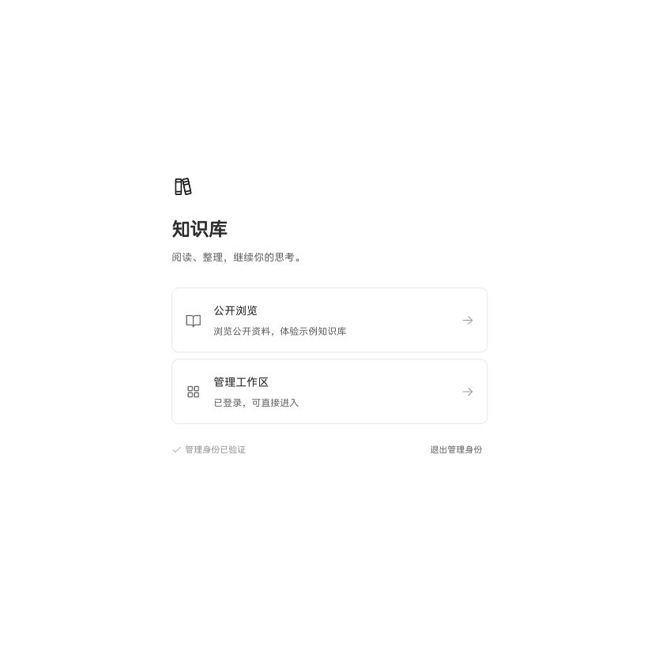

# 文档工作台

集中阅读、整理和编辑 Markdown、PDF 与 H5 文档的工作台。内容仍是普通文件，知识库、文件夹和文档都对应磁盘上的目录与文件。


## 阅读与导航

- 展开左侧栏管理文档；收起后仅保留入口图标与当前文档的章节短线。
- 章节短线垂直居中，悬停仅提示该章节标题，点击短线直接跳转。右侧目录打开时，左侧目录入口自动停用。
- 收起时点击左上角图标展开文档侧栏；展开时点击该图标切换知识库。
- 手机上的知识库切换采用弹窗。
- 多文档以标签切换；只打开一篇时显示普通标题。
- 默认使用非衬线字体，可调整字号、行距、正文宽度和主题。

## 编辑

选中文字后，在同一浮窗内使用「转换格式」、加粗、斜体、行内代码与链接。支持正文、一级至六级标题、代码块、引用和列表。

普通标题与折叠标题独立设置。文档与文件夹支持拖动排序，顺序保存在 `.顺序.json`。正文自动保存；覆盖前保留最近五个版本。编辑器无法完整还原的 Markdown 结构会切换到源码编辑，避免静默损失内容。

## 公开与锁定

`/onlyread` 是公开访客视角，始终只显示公开资料；`/doc` 是管理入口，验证密码后可以看到私有资料。首页提供「公开浏览 / 管理工作区」两个入口，未验证的管理地址先显示密码入口。管理员可维护锁定资料，不改变访客权限。公开与锁定是独立开关：

| 状态 | 行为 |
| --- | --- |
| 对外展示 | 未登录访问者可阅读 |
| 不对外展示 | 验证管理密码后才能看到 |
| 已锁定 | 访客不可修改，包含改名、移动、删除与排序；管理员仍可维护 |
| 未锁定且公开 | 访问者可以直接编辑，适合示例知识库 |

访客不能绕过父级隐藏或锁定。继承锁定可直接打开上级解锁确认；操作会影响该上级及继承它的内容。修改公开状态、锁定或解锁，均须重新输入管理密码。侧栏「切换入口」可以返回首页，并退出管理身份。状态图标显示在目录条目的右侧；当前文档也可从右上角三个点菜单设置。

服务端执行权限校验，界面隐藏按钮不能代替权限检查。管理会话使用 HttpOnly Cookie，不把密码保存在浏览器中，也不通过分享链接授予编辑权限。

「Agent（设计方向）」用于锁定的正式交付；「示例知识库」是公开可编辑的体验空间。私有知识库不会出现在访客的列表或接口结果中。

## 搜索与导出

- **左侧栏**：搜索当前知识库的文档名和路径。
- **右上角 / ⌘F / Ctrl+F**：查找当前 Markdown 文档正文。
- 手机查找框在顶栏下方展开，有明确的关闭按钮，也可点击外部关闭。
- 右上角同一菜单并排显示公开与锁定状态，并提供 Markdown 下载和打印 / 导出 PDF。


## 本地运行

```bash
npm install
DOCS_ROOT=/absolute/path/to/knowledge-base npm run dev
```

在服务端环境中配置 `READER_PASSWORD`，或将密码写入项目根目录的 `.admin-password`（此文件已被 Git 忽略，应限制为仅当前用户可读）。没有配置密码时，管理验证不会通过。

不要把密码、令牌、`.分享.json` 或私有知识库提交到公开仓库。

默认开发端口为 8090。新知识库默认不公开；可以在知识库菜单中验证密码后修改状态。

## 历史链接兼容

以下已交付地址继续有效：

- `/deepseek/reader/onlyread/` → 题目一
- `/deepseek/reader/onlyread/笔试题/笔试题交付：题目一` → 题目一
- `/deepseek/reader/onlyread/笔试题/笔试题交付：题目二` → 题目二

`/edit/<路径>` 兼容到管理入口。`/onlyread/<路径>` 保持公开访客视角，即使浏览器已有管理会话，也不会显示私有资料。公开且未锁定的示例库可以直接编辑。

## 工程结构

| 位置 | 职责 |
| --- | --- |
| `src/components/Sidebar.vue`、`DocTree.vue` | 知识库和文档导航 |
| `src/components/RailToc.vue`、`TocPanel.vue` | 简洁章节导航与右侧目录 |
| `src/components/MarkdownEditor.vue` | 富文本编辑、格式转换与内容保护 |
| `src/components/AccessDialog.vue` | 密码验证及状态操作 |
| `src/stores/docs.js` | 文档加载、缓存、标签与保存 |
| `src/utils/routes.js` | 统一入口与已交付书签兼容 |
| `server/content-api.js` | 文件接口、写入检查、历史备份 |
| `server/share.js` | 公开范围、继承锁和管理身份 |

技术栈：Vue 3、Pinia、Vite、Milkdown Crepe、Markdown-it、Shiki、Mermaid、PDF.js。

## 验证

```bash
npm run check
npm run test:access
npm run test:readonly
npm run test:block
npm run test:fold
npm run build
```

权限测试使用临时目录，覆盖公开过滤、密码验证、父级锁定、直接调用写接口、跨目录移动、删除、排序以及公开示例编辑。

## 部署

```bash
VITE_BASE=/deepseek/reader/ npm run build
DOCS_ROOT=/data/deepseek-reader-content PORT=8090 node server/serve.js
```

内容根目录应放在 Web 静态目录之外。对外仅暴露构建产物与受权限控制的 `/api`，不要把整个知识库目录作为静态目录发布。

部署前备份线上内容与服务配置，核对文件差异，保留服务器上的编辑。上线后检查三条历史地址、锁定资料的写入拒绝、示例库编辑，以及私有资料的访问拒绝。

### 入口选择



日常维护从首页进入管理工作区；给他人浏览使用 `/onlyread/`。管理员编辑无需解锁。修改访客权限时，从文档右上角或目录条目的三个点进入，修改公开或锁定状态仍需确认管理密码。

## 本地收尾审查（2026-09-23）

本轮通过：具名导入检查、构建、权限测试、保存备份与路径检查、标题折叠、块格式转换和入口路由测试（`npm run test:routes`）。浏览器实测公开入口只读、展开侧栏不连带打开知识库栏、关闭单个标签及刷新后保持关闭；本次浏览器检查未发现控制台错误。

补齐了私有文档列宽查询的权限校验、损坏 Cookie / URL 编码容错，并将默认构建资源前缀改为根路径，避免深层地址刷新时资源错位。部署到子路径时仍须设置 `VITE_BASE`。

上述结论针对本地版本；未部署、未推送。公网反向代理、内容目录隔离与线上历史链接需要在后续部署阶段再验收。

## 发布与内容更新约定

- 本地知识库是后续内容维护来源；不自动同步，收到明确更新指令后才发布。
- 线上仅包含 `Agent（设计方向）` 与 `示例知识库`。面试准备、简历、过程稿留在本地，不进入公开仓库与线上发布包。
- 公网内容根目录为 `/data/deepseek-reader-content`，位于静态目录之外。
- 首页提供公开浏览与管理入口；三个历史 `/onlyread/` 地址保留。旧 `/deepseek/demo/` 导向新的公开示例库。
- 发布前备份程序、内容、服务与反向代理配置；发布后验证旧链接、公开过滤及示例编辑权限。
