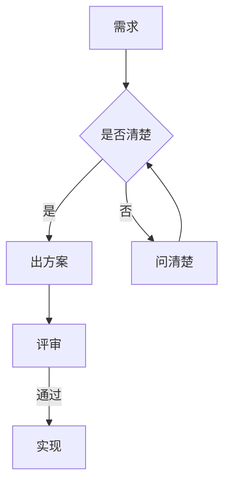
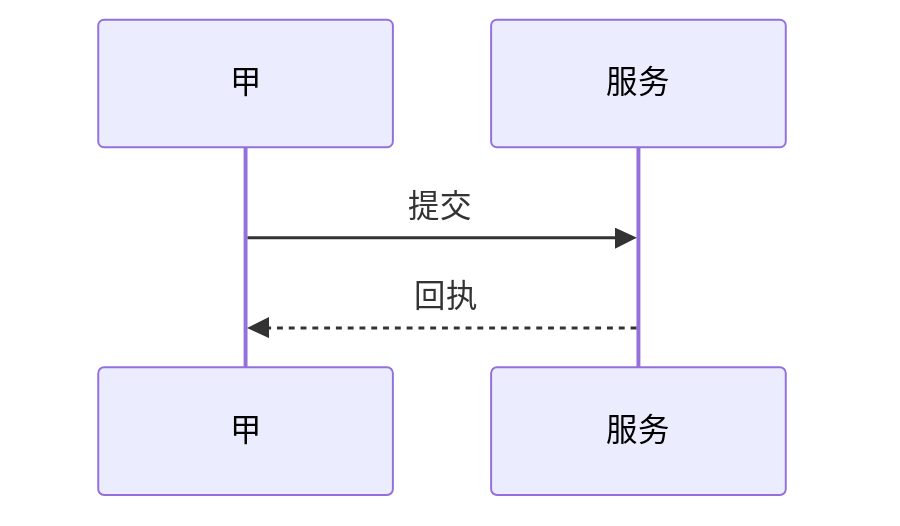

# 代码与图表

## 代码块

注明语言会有语法着色：

```ts
type Checkpoint = 'D1a' | 'D1b' | 'D2a' | 'D2b'
interface Score {
  checkpoint: Checkpoint
  value: 0 | 1 | 2 | 3 | 4 | -1
  note: string
}
function average(scores: Score[]): number {
  const valid = scores.filter(s => s.value >= 0)
  return valid.reduce((a, s) => a + s.value, 0) / valid.length
}
```

```bash
npm run dev        # 本地开发
npm run build      # 构建
npm test           # 跑测试
```

```json
{ "group": "G01", "round": "R8", "kind": "static" }
```

```css
.reading { font-size: 15.5px; line-height: 1.95; }
```

## 公式

行内公式 $E = mc^2$ 跟正文排在同一行。

块级公式单独占一行，居中：

$$
综合分 = 设计分 \times 0.85 + 达成率 \times 0.15
$$

## 图表

代码块里注明 mermaid，**编辑器里会实时渲染成图**贴在代码块旁边。这里是阅读态，显示的是源码。




